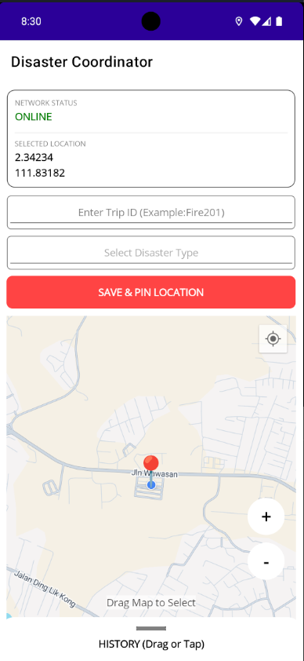
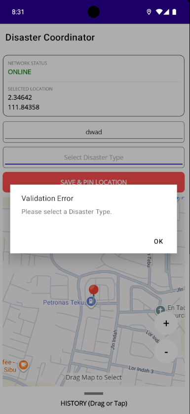
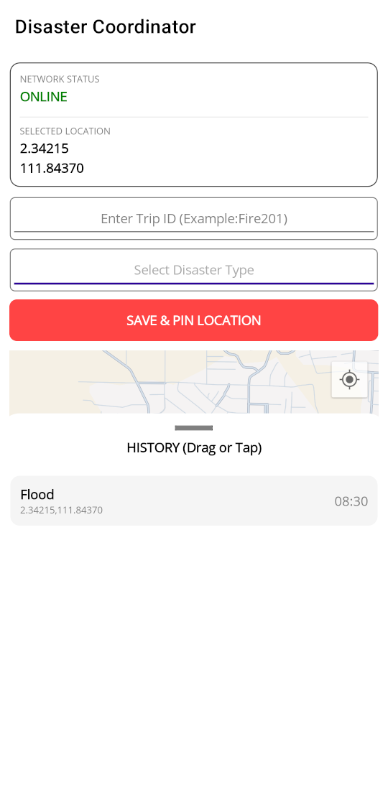

# Disaster Tracker App (CSS3344 Final Assessment)

**Student ID:** BCS23020005  
**Course:** CSS3344 Mobile Application Development  
**Semester:** September 2025/2026  
**Domain:** SOS-Emergency Service 

---

## 📌 Project Overview
This project is a .NET MAUI mobile application developed for the **CSS3344 Final Individual Assessment**. It is designed to assist emergency response coordinators by providing real-time geospatial data acquisition and secure offline data persistence. 

The application allows users to:
1.  **Monitor Connectivity:** View real-time Network Connectivity Status and Geolocation (Latitude/Longitude). 
2.  **Log Incidents:** Save incident details (Disaster Type, Location, Time) to a local SQLite database. 
3.  **Validate Data:** Enforce enterprise-level quality checks on User-Defined Trip IDs before saving. 
4.  **Visualize Data:** View historical logs on an interactive map and list.

---

## 🚀 Key Features (Rubric Coverage)

### ✅ Geospatial Data & UI 
* **Real-Time Connectivity:** The app checks for internet access upon launch and updates instantly if the status changes (Online/Offline).
* **Geolocation Display:** Displays the device's current Latitude and Longitude with high precision.
* **Responsive UI:** Uses a `Grid` layout to organize data clearly, ensuring the "Network Status" and "Location" are always visible at the top.

### [cite_start]✅ Secure Offline Persistence & Validation 
* **SQLite Integration:** Implements a full CRUD (Create, Read, Delete) architecture using `sqlite-net-pcl`.
* **Client-Side Validation:**
    * **Trip ID Check:** Prevents saving if the Trip ID is empty or less than 3 characters.
    * **Feedback:** Displays an immediate alert dialog to the user if validation fails, ensuring data integrity before it reaches the database.
* **User-Defined ID:** Allows the user to input a custom "Trip ID" (or Nickname) for every incident log.

---

## 🛠️ Technologies Used
* **Framework:** .NET MAUI (Multi-platform App UI) 
* **Language:** C#
* [cite_start]**Database:** SQLite (`sqlite-net-pcl`) [cite: 11]
* **Maps:** `Microsoft.Maui.Controls.Maps`
* [cite_start]**Sensors:** `Microsoft.Maui.Devices.Sensors` & `Connectivity` 

---

## 📸 Screenshots


| **Main Interface (Q1)** | **Validation Alert (Q2)** | **History & Map** |
|:-----------------------:|:-------------------------:|:-----------------:|
|  |  |  |
| *Shows Connectivity & Location* | *Shows Error Popup* | *Shows Saved Pins* |

> **Note:** Screenshots are stored in the `screenshots` folder of this repository.

---

## 📖 How to Use
1.  **Launch the App:** Grant location permissions if prompted.
2.  **Check Status:** Observe the **Network Status** and **Location** at the top of the screen.
3.  **Select Location:** Drag the map to pinpoint a specific disaster location.
4.  **Enter Details:**
    * Type a **Trip ID** (e.g., "Fire-01").
    * Select a **Disaster Type** from the picker.
5.  **Save:** Click **"SAVE & PIN LOCATION"**.
    * *Try entering a short ID (1 letter) to see the validation error.*
6.  **View History:** Pull up the "History" drawer at the bottom to see saved logs.

---

## ⚙️ Installation & Setup
1.  Clone the repository:
    ```bash
    git clone [https://github.com/your-username/disastertracker.git](https://github.com/your-username/disastertracker.git)
    ```
2.  Open the solution file (`FinalAssignment.sln`) in **Visual Studio 2022**.
3.  Ensure the Android Emulator is set up (API 33+ recommended).
4.  Build and Run the application.

---

## 📄 License
This project is for educational purposes only as part of the UTS CSS3344 assessment.